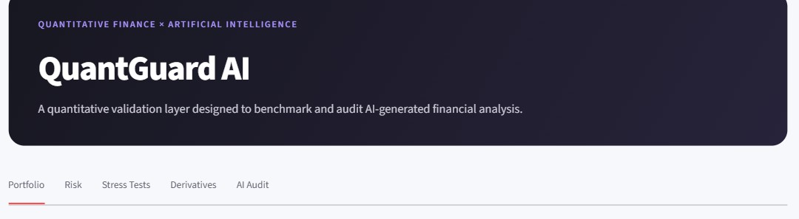

# Sofia Marques Ezechiello

Economics science student at **UFRGS**, building toward quantitative finance and risk.

I use quant models — VaR, Kupiec backtesting, portfolio optimization, option pricing — as an independent benchmark for financial claims, including the ones AI models make. If a number can't survive a benchmark check, I don't trust it, and I don't expect anyone else to either.

## Featured Project

### QuantGuard AI

  

A framework that benchmarks externally generated financial outputs (e.g. from AI models) against independent quantitative models, and flags when the numbers don't hold up.

* Mean-variance optimization — Maximum Sharpe & Minimum Variance portfolios, out-of-sample validated
* Sharpe Ratio adjusted by real CDI (Banco Central SGS API)
* Parametric VaR, Historical VaR, Expected Shortfall
* VaR backtesting with the Kupiec unconditional coverage test
* Historical and factor-based stress testing
* Black-Scholes vs. Monte Carlo option pricing, cross-validated against each other
* 18 automated tests (pytest)

**Repository:** [quantguard-ai](https://github.com/SofiaEzechiello/quantguard-ai)

## What I'm working on next

Walk-forward validation, the Christoffersen independence test, transaction costs, and volatility modeling — extending QuantGuard from a single train/test split to something closer to how risk models get validated in practice.

## Stack

Python | Pandas | NumPy | SciPy | Streamlit | Plotly | Git | Java

## Currently studying

Econometrics | Time Series | Asset Pricing | Mathematical Economics

---

Porto Alegre, Brazil 
